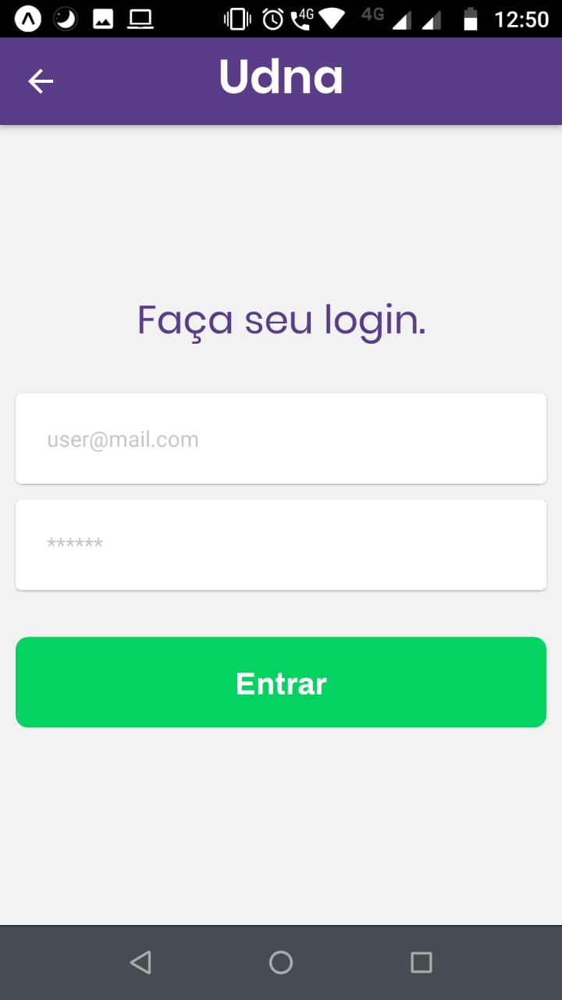
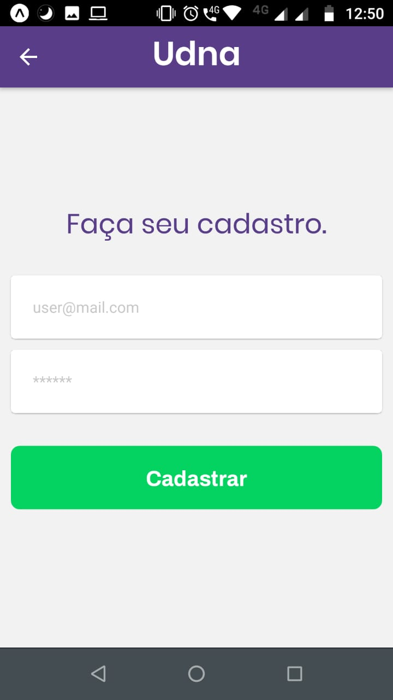

# app-teste-udna-mobile

Projeto mobile desenvolvido para o teste da Udna

## Características

A aplicação consiste em demonstrar um pouco dos meus conhecimentos em desenvolvimento mobile,
utilizando React Native e Expo. 

## Funcionalidades

O projeto conta com página `inicial`, `login e cadastro`, autenticação junto ao firebase, após autenticado
o usuário é redirecionado para a página `Home` com acesso aos serviços oferecidos pelo empresa, cada 
serviço com página própria, com `Detalhes` do serviço foto e descrição com opção de fazer o 
pedido do serviço, caso feito o pedido o usuário é redirecionado para a página de `Formulário` 
de compra, onde é requisitado seus dados, assim que preenchidos e enviados, 
os dados vão para o banco de dados do firebase.

## Demonstração das telas

### Landing, Login e Cadastro

  

    
    
    
  

### Home

  

    
    
  

### Services

  

    
    
  

### Contact Form

  

    
  

## Técnologias utilizadas

- JavaScript, React Native, Firebase, Expo, NPM, GIT...

## Rodando a aplicação Mobile

- Clone este respositório com o comando: $git clone git@github.com:2lipe/app-teste-mobile-udna.git
- Tenha o NPM ou Yarn instalados.

- Instale as dependências do projeto na pasta com o comando `npm install` ou `yarn install`.

- Após instalado as dependências execute o comando `npm start` a aplicação abrira o Expo,
rode o app no seu emulador ou escaneie o QR Code que abrirá no seu terminal com o seu Smartphone. 

Para rodar a aplicação mobile precisara do aplicativo Expo instalado em seu celular
(disponível na [App Store](https://apps.apple.com/br/app/expo-client/id982107779) e na [Google Play](https://play.google.com/store/apps/details?id=host.exp.exponent&hl=pt_BR)) ou apenas abra o emulador
pelo seu computador.

## Build do APK (irá expirar em 30 dias)

- Android: [https://expo.io/artifacts/c9997ca6-a9d9-4332-9d59-e7f60726d4f3]
- iOS(simulator): [https://expo.io/artifacts/c1909f67-f38b-4ba3-af80-69b7bdba11f5]
